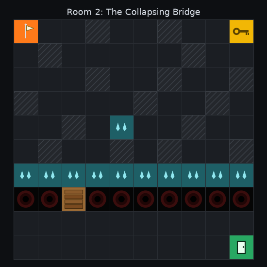
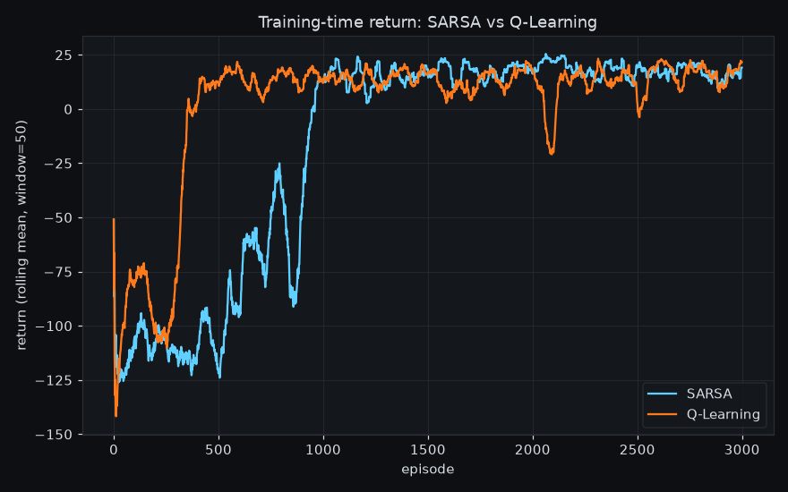
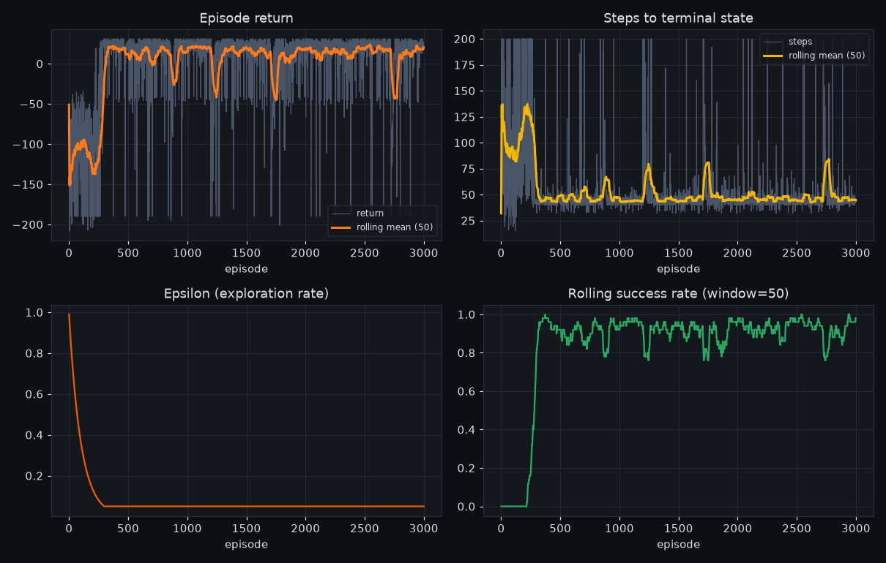

# Room 2 — The Collapsing Bridge (SARSA)

Escape-room chapter 2: an abandoned factory. The environment's transition
model is **unknown** to the agent, so it learns a policy purely from
experience using **SARSA** (on-policy Temporal-Difference control), rather
than by planning over a known model like Room 1's Dynamic Programming.

Theme: a chasm (the abyss) splits the factory in two. The only way across
is a single walkway (the bridge) that gives out the moment you step off
it. An key, tucked away from the direct route, unlocks the exit
door. Leaking pipes make some floor tiles slippery — including right at
the edge of the abyss, which is the point of this room (see "Core idea"
below).

## Run it

```bash
cd Room2Merav
pip install -r requirements.txt
streamlit run app.py
```

## State space

Discrete, **400 states** — `(row, col, has_key, bridge_collapsed)` on the
10x10 grid, flattened to a single index (`grid_env.GridWorld.encode_state`).
Both flags are part of the *true* state, not just bookkeeping:

- the same `(row, col)` cell means something different depending on
  whether the key was already collected (`G` only ends the
  episode once `has_key` is true)
- the bridge cell means something different depending on whether it's
  already been used (safe to cross the first time, fatal the second)

Leaving either out of the state would break the Markov property SARSA's
update rule relies on — the same position/action pair would need two
different values depending on unobserved history. The agent only ever
observes this index, never the transition probabilities: that's what
"model unknown" means here — SARSA learns `Q(s, a)` purely from
`(state, action, reward, next_state, next_action)` tuples collected by
interacting with the environment.

## Action space

Discrete(4): `0=UP, 1=RIGHT, 2=DOWN, 3=LEFT`. Moving into a wall or the
grid border leaves the agent in place — a wasted step that still costs the
step reward.

## Reward function

| Event | Reward |
|---|---|
| Every step | `-1` (time cost) |
| Falling into the abyss (`P`), or stepping back onto the **collapsed** bridge | `-20`, episode ends |
| Reaching the key (`K`), first time | `-1 + 10` (step cost + one-time subgoal bonus) |
| Reaching the door (`G`) **while holding the key** | `max(100 - steps_taken, 20)`, episode ends |
| Reaching `G` **without** the key | `-1` — door is locked, just a normal floor cell, episode continues |
| Truncated at `max_steps` without exiting | `0` bonus |

The exit bonus shrinks with the number of steps taken (down to a floor of
20), implementing the assignment's "the faster the agent escapes, the
higher the reward" requirement. The key's one-time `+10` is a subgoal
reward-shaping bonus: without it, the only feedback distinguishing "have
key" from "no key" is the (temporally distant) exit payoff, which gives
a flat tabular agent very little signal to bother detouring for it at all.

## Slippery cells (`~`) and the abyss edge

With probability `slip_prob` (default `0.2`) the actual move is one of the
two directions **perpendicular** to the intended one (FrozenLake-style).
Row 6 — right along the abyss (row 7) — is entirely slippery leaking-pipe
floor: reaching the bridge means walking that edge, where a slip can drop
the agent straight into the abyss below.

## The bridge (`B`)

Row 7 is the abyss except for a single bridge cell (column 2). Stepping
off the bridge **collapses it for the rest of the episode** — a second
crossing attempt falls straight through, exactly as fatal as the abyss
itself. The key sits on the near (start) side of the bridge, so
the intended solution never needs a second crossing; the collapse mainly
punishes an agent that hasn't planned its route (e.g. crossed before
grabbing the key).

## Room layout

```
S..#..#..K
.#.....#..
...#..#..#
#....#..#.
..#.~..#..
.#..#.#..#
~~~~~~~~~~
PPBPPPPPPP
..........
.........G
```

`S` start · `K` key · `G` door/exit (locked until key collected) ·
`#` wall · `~` slippery (leaking pipes) · `P` abyss · `B` bridge



Rendered in a dark, abandoned-factory palette (`viz.py`), with every
special cell drawn as a small hand-built icon rather than a letter — a
flag marking the start, a classic key silhouette (ring, shaft, teeth),
a door with a handle for the exit, concentric rings fading to black for
the abyss, wood-plank stripes for the bridge, and droplets for the
leaking pipes. The upper maze's walls are scattered single cells rather
than clustered blocks, standing in individually for factory machinery
rather than forming corridors. (Plain text labels were the original
design; matplotlib's Agg
backend can't actually render color emoji glyphs — the color-emoji font
crashes the renderer outright — so these are vector shapes drawn directly
with matplotlib patches, not font glyphs.) The same dark palette is
consistent across the grid, the learning-curve panels, and the
SARSA-vs-Q-Learning comparison plot below. The Streamlit app (`app.py`)
mirrors this with a dark, icon-labeled sidebar (grouped into SARSA
hyperparameters / Environment / Training run), an emoji-based legend (safe
there, since the sidebar is rendered by the browser, not matplotlib), a
styled header banner, and a "Mission briefing" panel.

Upper maze (rows 0-5) with the key tucked in the top-right corner
— off the direct route, forcing a real detour — a slippery band right at
the abyss edge (row 6), the abyss/bridge row (7), and a small goal room
(rows 8-9) with the locked door. "Repair area" (an added flavor note from
the assignment) is represented as the maze's walled sections generally —
no distinct game mechanic was specified for it, so it's treated as scenery
rather than a new hazard type.

BFS distances (ignoring the key/bridge-collapse requirements, since those
change *whether* a cell terminates or stays safe, not raw reachability):
`S → K` is 17 steps, `K → G` is 23 more — around 40 steps total, all
funneled through the row-7 bridge.

## SARSA update rule

```
Q(s, a) += alpha * (r + gamma * Q(s', a') - Q(s, a))
```

where `a'` is the action the agent will **actually** take next under its
own epsilon-greedy behavior policy — not the greedy max (that's
Q-Learning's off-policy update, Room 3). This is what makes SARSA
on-policy: it commits to the consequences of its own exploration when
updating its value estimates.

## Core idea: does SARSA actually pick a safer route?

The assignment's brief for this room asks us to show that SARSA picks a
safer path than an off-policy learner would — the classic Cliff Walking
result. `sarsa_vs_qlearning_demo.py` checks this empirically on Room 2's
own environment (a minimal Q-Learning agent, for this comparison only —
not Room 3's submission) rather than assuming it, because Room 2's hazard
works differently from Cliff Walking's:

- **In Cliff Walking**, the environment is deterministic — falling off the
  cliff can *only* happen because of the agent's own epsilon-greedy
  exploration. SARSA's update bootstraps off the action the behavior
  policy will *actually* take next, so it "prices in" its own future
  exploration mistakes near the cliff and learns to route around them;
  Q-Learning's update always bootstraps off the greedy action, so it
  assumes perfect play from here on and is happy to hug the edge.
- **In Room 2, the risk is a property of the environment's transition
  function** (the `~` slip mechanic), not of the agent's exploration
  policy. A slip can happen on the edge-hugging route *regardless* of
  which algorithm is driving, and both SARSA's and Q-Learning's Q-values
  correctly price that environmental risk into their targets — the
  specific mechanism that makes Q-Learning "reckless" in Cliff Walking
  doesn't obviously transfer here.

What we actually found (`sarsa_vs_qlearning_demo.py`, 3000 episodes,
`alpha=0.3, gamma=0.9, epsilon_decay=0.99`, averaged over several seeds):

- **Final learned (greedy) policies were nearly identical.** Across 4
  seeds, SARSA and Q-Learning converged to the same route in half the
  runs (96.5-100% success, ~41 steps, ~0.00-0.09 average lateral moves
  along the risky part of row 6) — confirming that when the danger is
  environmental rather than exploration-induced, there's no strong reason
  for one algorithm's final policy to be systematically safer than the
  other's.
- **Training-time return was still consistently a little higher for
  SARSA, though.** Averaged over the last 500 training episodes (with
  `epsilon_min=0.05` still active), SARSA scored higher than Q-Learning
  in all 4 seeds (16.97 vs 16.71, 15.70 vs 13.29, 19.44 vs 16.14, 15.07
  vs 12.84) — a smaller gap than with the previous (pre-scattered-walls)
  hyperparameters, but the direction held in every seed tried:

  

  This *is* the textbook effect, just showing up in training-time
  performance rather than in the final route: SARSA's Q-values account for
  the fact that it keeps exploring (with `epsilon_min > 0`) even late in
  training, so it favors a policy that's safer to execute *while still
  exploring*. Q-Learning's targets assume it will immediately act
  optimally, so it takes a bigger hit whenever its actual (still
  epsilon-greedy) behavior deviates from that assumption near the abyss.

**Takeaway for the defense**: SARSA being "more conservative" isn't a
universal law — it specifically compensates for risk that comes from the
agent's own ongoing exploration. Here, most of Room 2's risk is
environmental, so the two algorithms end up choosing nearly the same
route; where SARSA's caution actually pays off is in surviving its own
training process better, not in finding a fundamentally different final
path. Run `python3 sarsa_vs_qlearning_demo.py` to reproduce.

## Optimal hyperparameters

Found via `hyperparam_sweep.py`, which trains on a grid of
`(alpha, gamma, epsilon_decay)` — `slip_prob` and the reward shape are the
room's fixed design, not swept — and ranks configs by final greedy success
rate, then by convergence speed. With the key+bridge+slippery-edge design,
this is a genuinely hard credit-assignment problem: many `(alpha, gamma)`
combinations paired with a slow `epsilon_decay` (`0.999`) never converge
within 2000 episodes (0% success), and even the best configs don't reach
100% — the slippery abyss edge gives every crossing attempt some
irreducible risk, so a perfect success rate isn't achievable the way it
was before this room's redesign.

| Parameter | Value |
|---|---|
| `alpha` (learning rate) | **0.3** |
| `gamma` (discount) | **0.9** |
| `epsilon_start` | 1.0 |
| `epsilon_min` | 0.05 |
| `epsilon_decay` | **0.99** |

These are `TrainRoom2Config`'s defaults: ~99.75% greedy success at ~42
steps, converging by ~episode 435 — see `sweep_results.csv` for the full
grid. Full run (3000 episodes, these defaults):



- Success rate: 0% (first 50 episodes) → ~95-98% (last 50 episodes,
  training-time — still with `epsilon_min=0.05` exploration noise)
- Average steps on success: ~41-47, consistent with the ~40-step
  `S → K → bridge → G` shortest route

## Episode replay

`app.py`'s training run records the first, middle, and last episode's full
trajectory (state/action/reward per step) so you can step through them
afterward — compare the wandering, undertrained Episode 0 against the
converged final episode.

## Files

| File | Contents |
|---|---|
| `grid_env.py` | 10x10 grid engine: movement, walls, slip mechanic, key/bridge state, terminal states |
| `room2_env.py` | Room 2's specific layout and reward shaping |
| `sarsa_agent.py` | On-policy SARSA agent (epsilon-greedy, tabular `Q(s,a)`) |
| `train_room2.py` | Training loop, per-episode logging, trajectory recording |
| `hyperparam_sweep.py` | Sweeps alpha/gamma/epsilon_decay, ranks by success rate + convergence speed |
| `sarsa_vs_qlearning_demo.py` | Side-by-side SARSA vs. Q-Learning comparison (this room's "core idea" check) |
| `viz.py` | Learning-curve plots, grid rendering, episode-replay rendering |
| `app.py` | Streamlit UI: hyperparameter controls, training, plots, replay |
